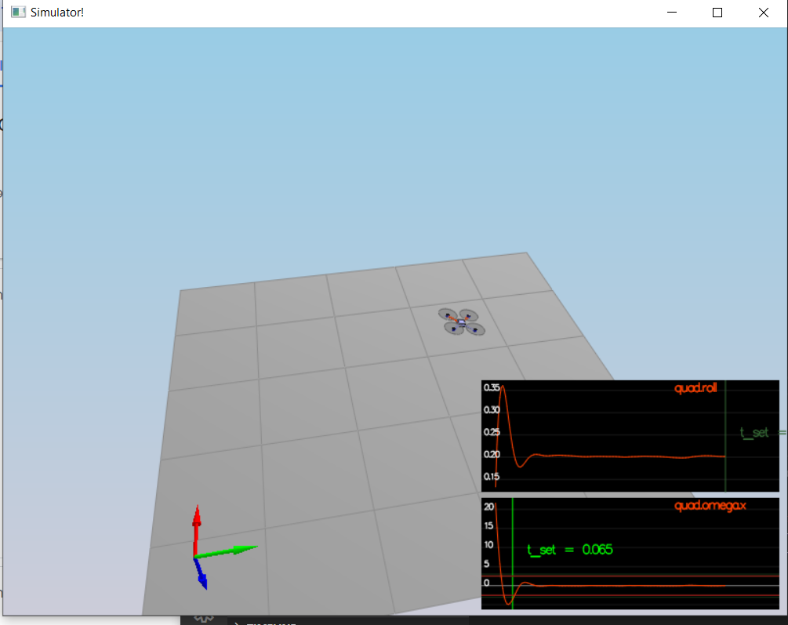
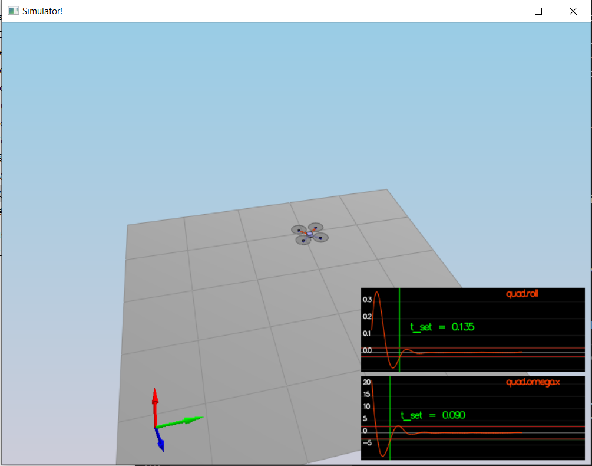
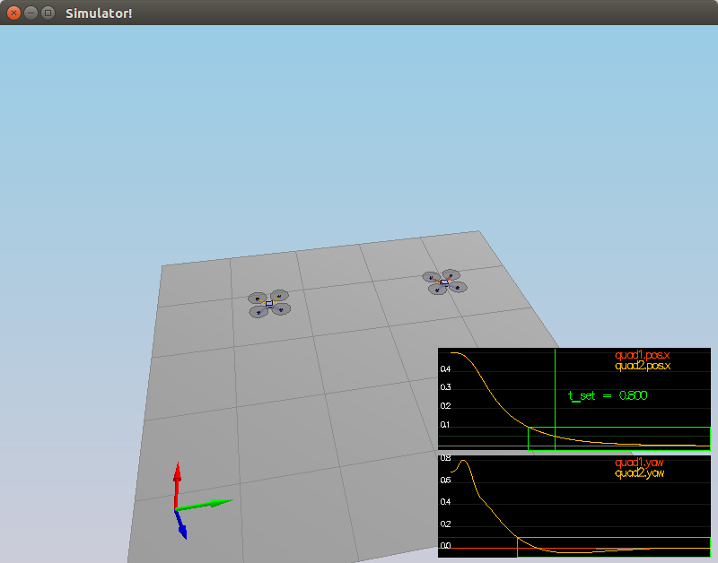
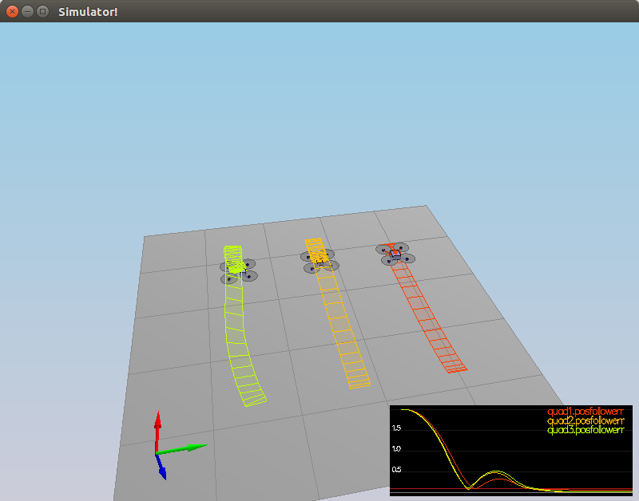

# The Quadrotor PID Cascaded 3D Controller #


## Development Environment Setup ##

For environment setting and build steps, please checkout the original [README](./README.md).


## Run The Tasks ##

First you need to run the simulator.


### Then in `scenario 1`:

The quad is falling straight down because the mass is not match the actual mass, I change the `Mass` from `0.4` to `0.5` in `QuadControlParams.txt`, and perform better as below.

<p align="center">

</p>

### Body rate and roll/pitch control (scenario 2) ###

1. Implement body rate control

 - In `GenerateMotorCommands()` I just solved the equation:

    `tau_x / l = F_1 + F_4 - F_2 - F_3`

    `tau_y / l = F_1 + F_2 - F_3 - F_4`

    `tau_z / kappa = F_1 - F_2 + F_3 - F_4`

    `c_total = F_1 + F_2 + F_3 + F_4`
    to get F_1 - F_4, these are the command thrusts to each rotor.

 - `BodyRateControl()` is a simple one that just calculate the acceleration and convert to moment by one line code: `V3F(Ixx, Iyy, Izz) * kpPQR * (pqrCmd - pqr)`,
    `V3F(Ixx, Iyy, Izz)` is the moments of inertia of each direction.
 - Tune `kpPQR` in `QuadControlParams.txt` to get the vehicle to stop spinning quickly but not overshoot
 - After tuning the drone can stop rotation very quickly but the angle is not yet being controlled back to 0 since there is no roll-pitch control to the vehicle.

<p align="center">

</p>

2. Implement roll / pitch control

 - This function need a little tricky, it need to get `target_R13` and `target_R23` by doing like this `float target_R13 = CONSTRAIN(accelCmd.x / c_d, -maxTiltAngle, maxTiltAngle);`, the `CONSTRAIN` is something like `np.crop()` in python.
 and then solve this equations:
    
    $$
    \begin{pmatrix} p_c \\ q_c \\ \end{pmatrix}  = \frac{1}{R_{33}}\begin{pmatrix} R_{21} & -R_{11} \\ R_{22} & -R_{12} \end{pmatrix} \times \begin{pmatrix} \dot{b}^x_c \\ \dot{b}^y_c  \end{pmatrix} 
    $$
 - Tune `kpBank` in `QuadControlParams.txt` and should see the vehicle angle (Roll) get controlled to 0.

<p align="center">

</p>


### Position/velocity and yaw angle control (scenario 3) ###

 - `LateralPositionControl()` is a typically a PD controller. But need to handle maximum acceleration. Notice that it use `mag()` and `norm()` instead of largest number, it's terms in linear algebra.
 - `AltitudeControl()` calculate PD terms to get `u_1_bar`, and use $$c = (\bar{u}_1-g)/b^z$$  
    to get world frame acceleration. 
 - I don't think it's a good idea that (`kpVelXY` and `kpVelZ`) take 3-4 times greater than the (`kpPosXY` and `kpPosZ`).
 - In the reviewer's suggestion code `thrust = mass * (CONST_GRAVITY - (accelCmd / R(2, 2)))`, I'm a little confused it's not match the equation $$c = (\bar{u}_1-g)/b^z$$.

<p align="center">

</p>
    
### Non-idealities and robustness (scenario 4) ###

 - I add a integral term with `KiPosZ * integratedAltitudeError`, then the red one can fly to the goal(without a little shift back to the goal).
 - I reduced the position and velocity value and it performance better and more smooth and stable.
 
<p align="center">


</p>
 

### Extra Challenge 1 (Optional) ###

 - Change the initial value of `pz` from 0 to the nearest z value in the trajectory to avoid the first `vz` is too large.
 - I just add a coefficient to control the velocity.
   ```
   vx = 1.0 * (x - px) / timestep;
   vy = 1.0 * (y - py) / timestep;
   vz = 1.0 * (z - pz) / timestep;
   ```
 - After speed up the drone, I need to tune some params again to give more control.